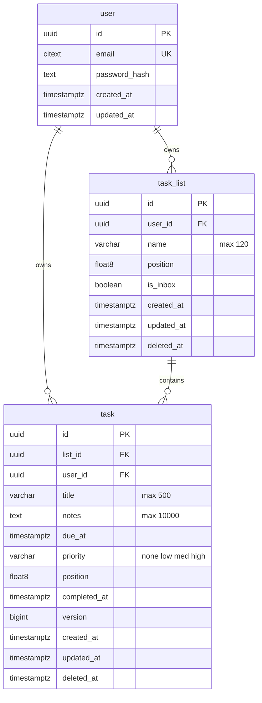

# Locked Decisions for Story 667fae03-3226-4e57-b2e0-a51dd64d1ddf

## Implementation Approach
## Implementation Approach

### File Structure

Following the locked modular monolith pattern:

```
src/modules/tasks/
  router.ts        # POST /v1/tasks route, Zod validation, calls service
  service.ts       # Business logic: ownership check, position calc, create
  schemas.ts       # Zod schemas + zod-to-openapi registration
```

### Request Flow

```
POST /v1/tasks
  → auth middleware (extracts userId from JWT)
  → tasks router (parses & validates body via Zod)
  → taskService.create(userId, validatedBody)
      1. Verify list ownership: SELECT id FROM task_list WHERE id = listId AND user_id = userId AND deleted_at IS NULL
         → If not found, throw NotFoundError (returns 404)
      2. Calculate position:
         - If position provided → use it
         - If not → SELECT MIN(position) FROM task WHERE list_id = listId AND user_id = userId AND deleted_at IS NULL
           → new position = min - 1024.0 (or 1024.0 if list is empty)
      3. INSERT task with all fields, RETURNING full row
      4. Return created task
  → router serializes response (201)
```

### Key Implementation Details

**Tenant isolation** — The service method signature is `create(userId: string, input: CreateTaskInput)`. The `userId` comes from the auth middleware and is passed explicitly — never read from request context. The composite FK `(list_id, user_id)` provides a DB-level backstop, but the service performs an explicit ownership check first to return a clean 404.

**Position assignment** — Default is top-of-list:
- Query: `SELECT MIN(position) FROM task WHERE list_id = ? AND user_id = ? AND deleted_at IS NULL`
- If result is null (empty list): position = `1024.0`
- Otherwise: position = `min_position - 1024.0`
- The gap of 1024.0 provides room for future insertions above
- Rebalancing (when gap < 1e-6) is part of the Reorder story, not this one

**UUID generation** — Handled by PostgreSQL via `gen_random_uuid()` (pgcrypto), not application-side. This avoids any UUID library dependency and guarantees uniqueness at the DB level.

**Timestamps** — `created_at` and `updated_at` default to `now()` in the DB. The service does not set them manually.

**Version** — Defaults to `0` in the DB. Not sent in the create request — only relevant for updates (optimistic concurrency story).

**Prisma query** — Uses explicit `select` (no lazy-loading, per architecture rules):

```typescript
const task = await prisma.task.create({
  data: {
    listId: input.listId,
    userId,
    title: input.title.trim(),
    notes: input.notes ?? null,
    dueAt: input.dueAt ?? null,
    priority: input.priority ?? 'none',
    position: calculatedPosition,
  },
  select: {
    id: true,
    listId: true,
    title: true,
    notes: true,
    dueAt: true,
    priority: true,
    position: true,
    completedAt: true,
    version: true,
    createdAt: true,
    updatedAt: true,
  },
});
```

### Error Handling

- Zod validation failures are caught by the router's validation middleware → 422 with per-field details
- `NotFoundError` from the service layer → 404 via the centralized error handler
- Unexpected DB errors → 500 via the centralized error handler with no internal details leaked

### Testing Requirements (per locked Testing Strategy)

- **Unit tests**: `taskService.create()` with mocked Prisma — happy path, missing list, other user's list, position calculation (empty list, non-empty list)
- **Integration tests**: Full HTTP round-trip via Supertest + Testcontainers — all 7 ACs
- **Tenancy test**: User A creates task in User B's list → expects 404

## Data Mapping
## Task Table Schema (Greenfield)

This is a new project with no existing tables. The `task` table is the primary entity for this story, with FKs to `task_list` and `user` (which will be created by their respective stories).

### Mermaid ER Diagram



### Task Table Columns

| Column | Type | Constraints | Default | Notes |
|--------|------|-------------|---------|-------|
| `id` | `uuid` | PK | `gen_random_uuid()` | Via `pgcrypto` extension |
| `list_id` | `uuid` | NOT NULL, FK | — | Part of composite FK |
| `user_id` | `uuid` | NOT NULL, FK | — | Part of composite FK, tenant isolation |
| `title` | `varchar(500)` | NOT NULL | — | Check: not blank after trim |
| `notes` | `text` | — | `NULL` | Max 10,000 chars (app-level) |
| `due_at` | `timestamptz` | — | `NULL` | RFC 3339 input |
| `priority` | `varchar(4)` | NOT NULL | `'none'` | Enum: `none`, `low`, `med`, `high` |
| `position` | `float8` | NOT NULL | — | Float ordering within list |
| `completed_at` | `timestamptz` | — | `NULL` | NULL = not completed |
| `version` | `bigint` | NOT NULL | `0` | Optimistic concurrency |
| `created_at` | `timestamptz` | NOT NULL | `now()` | — |
| `updated_at` | `timestamptz` | NOT NULL | `now()` | — |
| `deleted_at` | `timestamptz` | — | `NULL` | Soft-delete marker |

### Constraints

- **Composite FK** (DB-2): `FOREIGN KEY (list_id, user_id) REFERENCES task_list(id, user_id)` — makes cross-tenant list assignment unrepresentable at the DB level. Requires a `UNIQUE(id, user_id)` on `task_list`.
- **Check**: `ck_task_title_not_blank` — `CHECK (trim(title) <> '')`
- **Check**: `ck_task_priority_valid` — `CHECK (priority IN ('none', 'low', 'med', 'high'))`

### Indexes

| Index | Columns | Purpose |
|-------|---------|---------|
| `ix_task_user_list` | `(user_id, list_id, deleted_at)` | Tenant-scoped list filtering (partial: `WHERE deleted_at IS NULL`) |
| `ix_task_position` | `(list_id, position)` | Position ordering within a list (partial: `WHERE deleted_at IS NULL`) |
| `ix_task_purge` | `(deleted_at)` | Hard purge job (partial: `WHERE deleted_at IS NOT NULL`) |

### Prisma Model

```prisma
model Task {
  id          String    @id @default(dbgenerated("gen_random_uuid()")) @db.Uuid
  listId      String    @map("list_id") @db.Uuid
  userId      String    @map("user_id") @db.Uuid
  title       String    @db.VarChar(500)
  notes       String?
  dueAt       DateTime? @map("due_at") @db.Timestamptz()
  priority    String    @default("none") @db.VarChar(4)
  position    Float     @db.DoublePrecision
  completedAt DateTime? @map("completed_at") @db.Timestamptz()
  version     BigInt    @default(0)
  createdAt   DateTime  @default(now()) @map("created_at") @db.Timestamptz()
  updatedAt   DateTime  @default(now()) @updatedAt @map("updated_at") @db.Timestamptz()
  deletedAt   DateTime? @map("deleted_at") @db.Timestamptz()

  list TaskList @relation(fields: [listId, userId], references: [id, userId])
  user User     @relation(fields: [userId], references: [id])

  @@map("task")
}
```

### Notes
- All timestamps use `timestamptz` (DB-4: no naive datetimes)
- `priority` stored as short varchar rather than a Postgres ENUM type — avoids migration hassle when adding/renaming values later; app-level Zod validation + DB CHECK ensure correctness
- `position` as `float8` (double precision) per DB-5, with rebalancing when gap < 1e-6

## Validation
## Validation Rules & Edge Cases

### Zod Schema (Single Source of Truth)

```typescript
const CreateTaskSchema = z.object({
  listId: z.string().uuid("Must be a valid UUID"),
  title: z.string()
    .min(1, "Title is required")
    .max(500, "Title must be at most 500 characters")
    .transform(v => v.trim())
    .pipe(z.string().min(1, "Title must not be blank")),
  notes: z.string()
    .max(10_000, "Notes must be at most 10000 characters")
    .optional(),
  dueAt: z.string()
    .datetime({ message: "Must be a valid RFC 3339 datetime" })
    .optional(),
  priority: z.enum(["none", "low", "med", "high"], {
    errorMap: () => ({ message: "Priority must be one of: none, low, med, high" })
  }).optional(),
  position: z.number()
    .finite("Position must be a finite number")
    .optional(),
});
```

### Validation Rules by Field

| Field | Rule | AC |
|-------|------|----|
| `listId` | Required, valid UUID format | AC1 |
| `title` | Required, 1–500 chars after trim, must not be blank/whitespace-only | AC1, AC3, AC4 |
| `notes` | Optional, max 10,000 chars | AC2, AC4 |
| `dueAt` | Optional, valid RFC 3339 datetime string | AC2 |
| `priority` | Optional, must be `none`, `low`, `med`, or `high` | AC2, AC6 |
| `position` | Optional, finite float | AC2, AC7 |

### Edge Cases & Business Rules

1. **Whitespace-only title** (AC3): `"   "` → trim → `""` → fails `min(1)` → 422. The Zod `transform + pipe` pattern handles this: first trim, then re-validate length.

2. **Title exactly 500 chars**: Valid. Title of 501 chars → 422.

3. **Notes exactly 10,000 chars**: Valid. Notes of 10,001 chars → 422.

4. **Other user's list** (AC5): Service checks `task_list WHERE id = listId AND user_id = userId AND deleted_at IS NULL`. If no match → `NotFoundError` → 404. The composite FK is a DB-level backstop, but the service-level check provides the correct error code without exposing existence.

5. **Soft-deleted list**: If a user's own list is soft-deleted, the ownership query filters on `deleted_at IS NULL`, so it returns 404 — tasks cannot be created in deleted lists.

6. **Non-existent listId**: Same 404 path as "other user's list" — no information leakage.

7. **Invalid priority** (AC6): `"urgent"`, `"HIGH"` (case-sensitive), `""`, or `123` → 422 from Zod enum validation.

8. **Position edge cases**: 
   - `NaN`, `Infinity`, `-Infinity` → rejected by `z.number().finite()`
   - Very large or very small floats → accepted (float8 handles them)
   - Negative values → accepted (valid for ordering)

9. **Extra fields in body**: Zod strips unknown fields by default (`.strict()` is not used) — extra fields are silently ignored per REST convention.

10. **Empty body / missing content-type**: Express JSON parser returns 400 before Zod runs. The error handler normalizes this into the standard error envelope.

### Validation Error Format

Per the locked security decision, all validation errors return:

```json
{
  "error": {
    "code": "VALIDATION_ERROR",
    "message": "Validation failed",
    "details": [
      { "field": "title", "message": "Title is required" },
      { "field": "priority", "message": "Priority must be one of: none, low, med, high" }
    ]
  }
}
```

Multiple field errors are returned together (Zod validates all fields, not fail-fast).

## API Design
## POST /v1/tasks — API Contract

### Request

**Method**: `POST`  
**Path**: `/v1/tasks`  
**Auth**: Bearer JWT (required)  
**Content-Type**: `application/json`

#### Request Body

```json
{
  "listId": "uuid (required)",
  "title": "string, 1–500 chars (required)",
  "notes": "string, ≤10,000 chars (optional)",
  "dueAt": "RFC 3339 datetime string (optional)",
  "priority": "none | low | med | high (optional, defaults to 'none')",
  "position": "float (optional, defaults to top-of-list)"
}
```

### Success Response — 201 Created

Returns the full task object:

```json
{
  "id": "a1b2c3d4-...",
  "listId": "e5f6a7b8-...",
  "title": "Buy groceries",
  "notes": "Milk, eggs, bread",
  "dueAt": "2026-08-15T10:00:00Z",
  "priority": "med",
  "position": 1024.0,
  "completedAt": null,
  "version": 0,
  "createdAt": "2026-07-30T12:00:00Z",
  "updatedAt": "2026-07-30T12:00:00Z"
}
```

**Notes on response shape:**
- Flat object — no nested `list` or `user` objects (the caller already knows the `listId` they sent)
- `userId` is deliberately **omitted** from the response — it's implicit from the auth context and exposing it adds no value
- `deletedAt` is omitted — newly created tasks are never soft-deleted
- All timestamps returned as ISO 8601 / RFC 3339 UTC strings

### Error Responses

All errors use the standard envelope: `{ "error": { "code": "...", "message": "...", "details": [...] } }`

| Scenario | Status | Code | Details |
|----------|--------|------|---------|
| Missing/blank title | 422 | `VALIDATION_ERROR` | Per-field: `[{ "field": "title", "message": "Title is required" }]` |
| Title > 500 chars | 422 | `VALIDATION_ERROR` | Per-field: `[{ "field": "title", "message": "Title must be at most 500 characters" }]` |
| Notes > 10,000 chars | 422 | `VALIDATION_ERROR` | Per-field: `[{ "field": "notes", "message": "Notes must be at most 10000 characters" }]` |
| Invalid priority | 422 | `VALIDATION_ERROR` | Per-field: `[{ "field": "priority", "message": "Priority must be one of: none, low, med, high" }]` |
| Invalid dueAt format | 422 | `VALIDATION_ERROR` | Per-field: `[{ "field": "dueAt", "message": "Must be a valid RFC 3339 datetime" }]` |
| Missing listId | 422 | `VALIDATION_ERROR` | Per-field: `[{ "field": "listId", "message": "List ID is required" }]` |
| listId not found / other user's list | 404 | `NOT_FOUND` | `"List not found"` (no 403 — don't confirm existence) |
| No auth token | 401 | `UNAUTHORIZED` | `"Authentication required"` |
| Invalid/expired token | 401 | `UNAUTHORIZED` | `"Invalid or expired token"` |
