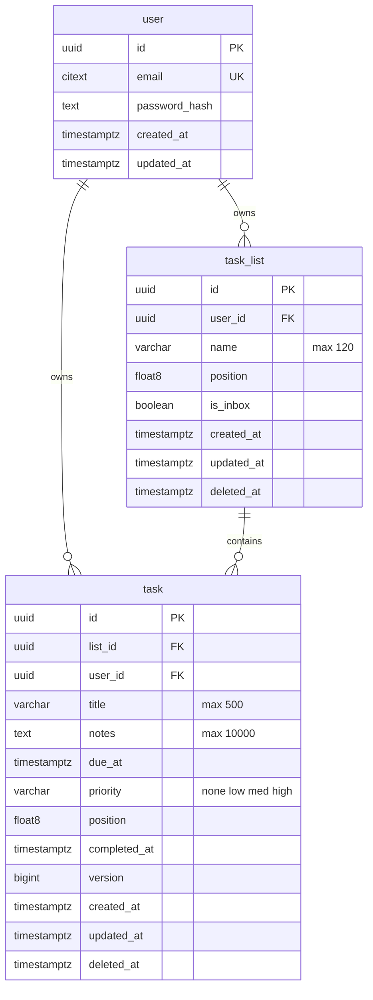

# Data Mapping

## Task Table Schema (Greenfield)

This is a new project with no existing tables. The `task` table is the primary entity for this story, with FKs to `task_list` and `user` (which will be created by their respective stories).

### Mermaid ER Diagram



### Task Table Columns

| Column | Type | Constraints | Default | Notes |
|--------|------|-------------|---------|-------|
| `id` | `uuid` | PK | `gen_random_uuid()` | Via `pgcrypto` extension |
| `list_id` | `uuid` | NOT NULL, FK | — | Part of composite FK |
| `user_id` | `uuid` | NOT NULL, FK | — | Part of composite FK, tenant isolation |
| `title` | `varchar(500)` | NOT NULL | — | Check: not blank after trim |
| `notes` | `text` | — | `NULL` | Max 10,000 chars (app-level) |
| `due_at` | `timestamptz` | — | `NULL` | RFC 3339 input |
| `priority` | `varchar(4)` | NOT NULL | `'none'` | Enum: `none`, `low`, `med`, `high` |
| `position` | `float8` | NOT NULL | — | Float ordering within list |
| `completed_at` | `timestamptz` | — | `NULL` | NULL = not completed |
| `version` | `bigint` | NOT NULL | `0` | Optimistic concurrency |
| `created_at` | `timestamptz` | NOT NULL | `now()` | — |
| `updated_at` | `timestamptz` | NOT NULL | `now()` | — |
| `deleted_at` | `timestamptz` | — | `NULL` | Soft-delete marker |

### Constraints

- **Composite FK** (DB-2): `FOREIGN KEY (list_id, user_id) REFERENCES task_list(id, user_id)` — makes cross-tenant list assignment unrepresentable at the DB level. Requires a `UNIQUE(id, user_id)` on `task_list`.
- **Check**: `ck_task_title_not_blank` — `CHECK (trim(title) <> '')`
- **Check**: `ck_task_priority_valid` — `CHECK (priority IN ('none', 'low', 'med', 'high'))`

### Indexes

| Index | Columns | Purpose |
|-------|---------|---------|
| `ix_task_user_list` | `(user_id, list_id, deleted_at)` | Tenant-scoped list filtering (partial: `WHERE deleted_at IS NULL`) |
| `ix_task_position` | `(list_id, position)` | Position ordering within a list (partial: `WHERE deleted_at IS NULL`) |
| `ix_task_purge` | `(deleted_at)` | Hard purge job (partial: `WHERE deleted_at IS NOT NULL`) |

### Prisma Model

```prisma
model Task {
  id          String    @id @default(dbgenerated("gen_random_uuid()")) @db.Uuid
  listId      String    @map("list_id") @db.Uuid
  userId      String    @map("user_id") @db.Uuid
  title       String    @db.VarChar(500)
  notes       String?
  dueAt       DateTime? @map("due_at") @db.Timestamptz()
  priority    String    @default("none") @db.VarChar(4)
  position    Float     @db.DoublePrecision
  completedAt DateTime? @map("completed_at") @db.Timestamptz()
  version     BigInt    @default(0)
  createdAt   DateTime  @default(now()) @map("created_at") @db.Timestamptz()
  updatedAt   DateTime  @default(now()) @updatedAt @map("updated_at") @db.Timestamptz()
  deletedAt   DateTime? @map("deleted_at") @db.Timestamptz()

  list TaskList @relation(fields: [listId, userId], references: [id, userId])
  user User     @relation(fields: [userId], references: [id])

  @@map("task")
}
```

### Notes
- All timestamps use `timestamptz` (DB-4: no naive datetimes)
- `priority` stored as short varchar rather than a Postgres ENUM type — avoids migration hassle when adding/renaming values later; app-level Zod validation + DB CHECK ensure correctness
- `position` as `float8` (double precision) per DB-5, with rebalancing when gap < 1e-6
