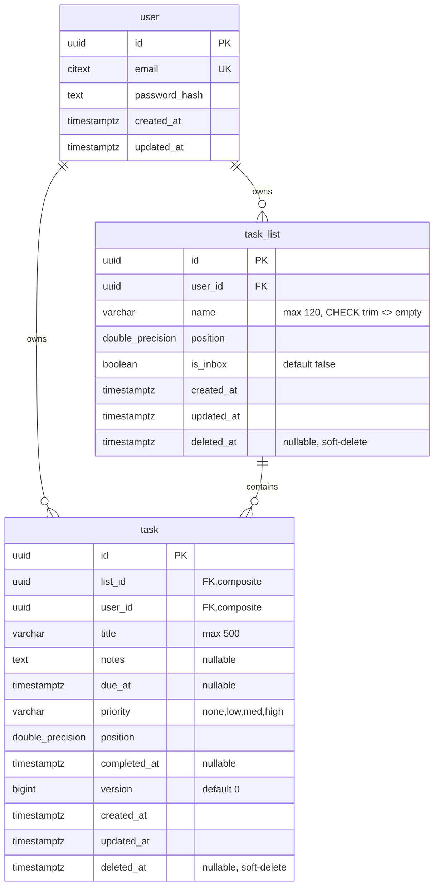

# Locked Decisions for Story d326809f-e2b7-46f4-950a-5c5435531a3c

## Implementation Approach
## Implementation Approach — Lists Module

### Module Structure
Create `src/modules/lists/` mirroring the existing `tasks/` module exactly:

```
src/modules/lists/
  router.ts        # POST / with authenticate + validate middleware
  service.ts       # listService.create(userId, input)
  schemas.ts       # CreateListSchema (Zod)
  __tests__/
    schemas.test.ts              # Unit: Zod schema validation
    service.test.ts              # Unit: service with mocked Prisma
    lists.integration.test.ts    # Integration: Supertest + real DB
```

### Router (`router.ts`)
- Single route: `POST /` guarded by `authenticate` → `validate(CreateListSchema)` → handler
- Handler calls `listService.create(req.userId!, req.body)`, returns `res.status(201).json(list)`
- Errors forwarded via `next(err)` to the centralized error handler
- Follows the exact pattern from `tasks/router.ts`

### Service (`service.ts`)
- **`listService.create(userId, input)`** — `userId` as explicit first argument (tenant isolation rule)
- **Position calculation (bottom-append)**:
  1. Query `prisma.taskList.aggregate()` for `_max: { position: true }` where `userId` + `deletedAt: null`
  2. If no existing lists → position = `1024.0`
  3. Otherwise → position = `maxPosition + 1024.0`
- **Create**: `prisma.taskList.create()` with `isInbox: false`, `deletedAt` left as default `null`
- **Explicit select**: only the fields needed for the response (no lazy-loading)
- **Serialize**: convert `Date` → ISO string, omit `userId` and `deletedAt`

### Wiring (`app.ts`)
Add one line:
```ts
import listsRouter from './modules/lists/router';
app.use('/v1/lists', listsRouter);
```

### Database Migration
A new Prisma migration adds the `ck_task_list_name_not_blank` CHECK constraint referenced in the story source:
```sql
ALTER TABLE "task_list"
  ADD CONSTRAINT "ck_task_list_name_not_blank"
  CHECK (trim(name) <> '');
```
This is a defense-in-depth measure — Zod validates before the query, but the DB constraint prevents bad data from any path.

### Testing Strategy
Following the tasks module test patterns:

1. **Schema unit tests** (`schemas.test.ts`): valid name, blank name, whitespace-only, > 120 chars, boundary at 120, trim behavior
2. **Service unit tests** (`service.test.ts`): mock Prisma, verify position calculation (empty list, non-empty), verify serialization (Date → ISO, omit userId/deletedAt)
3. **Integration tests** (`lists.integration.test.ts`): Supertest against real DB
   - AC1: POST with valid name → 201, response shape, DB verification
   - AC2: blank/whitespace name → 422 with field-level error
   - AC3: name > 120 chars → 422
   - AC4: no auth → 401
   - AC5: tenant isolation — user A's list has correct userId, user A cannot see user B's lists
4. **Tenancy test case**: user A attempts cross-tenant list creation confirmation (userId is server-set, not client-provided)

## Data Mapping
## Data Mapping — task_list Table (Already Exists)

### No New Table Required
The `task_list` table already exists in the Prisma schema and the init migration (`20260731045744_init`). All columns needed by this story are present.

### Existing Schema



### Migration Required — CHECK Constraint Only

The init migration is missing the `ck_task_list_name_not_blank` CHECK constraint referenced in the story's source reference. A new migration adds it:

```sql
ALTER TABLE "task_list"
  ADD CONSTRAINT "ck_task_list_name_not_blank"
  CHECK (trim(name) <> '');
```

This mirrors the existing `ck_task_title_not_blank` constraint on the `task` table.

### Column Usage for POST /v1/lists

| Column | Source | Notes |
|--------|--------|-------|
| `id` | `gen_random_uuid()` | DB-generated |
| `user_id` | JWT `sub` claim | Set by service, never from client |
| `name` | Request body | Trimmed by Zod, 1–120 chars |
| `position` | Server-calculated | `max(position) + 1024` for user's non-deleted lists |
| `is_inbox` | Hardcoded `false` | User-created lists are never inbox |
| `created_at` | DB default | `CURRENT_TIMESTAMP` |
| `updated_at` | DB default | `CURRENT_TIMESTAMP` |
| `deleted_at` | DB default | `NULL` |

### Existing Constraints & Indexes (No Changes)
- **PK**: `task_list_pkey` on `id`
- **Unique**: `task_list_id_user_id_key` on `(id, user_id)` — enables composite FK from tasks
- **FK**: `task_list_user_id_fkey` → `user(id)`
- No additional indexes needed for this story (creation-only, no listing/querying)

## Validation
## Validation — CreateListSchema

### Zod Schema Definition

```ts
export const CreateListSchema = z.object({
  name: z
    .string()
    .min(1, 'Name is required')
    .max(120, 'Name must be at most 120 characters')
    .transform((v) => v.trim())
    .pipe(z.string().min(1, 'Name must not be blank')),
});
```

This uses the **exact same trim-then-check pattern** as the existing `CreateTaskSchema.title` field:
1. `min(1)` rejects empty strings before trim
2. `max(120)` enforces length limit on the raw input
3. `.transform(trim)` strips leading/trailing whitespace
4. `.pipe(min(1))` rejects whitespace-only strings after trimming

### Validation Rules Summary

| Input | Result | AC |
|-------|--------|----|
| `{ "name": "Shopping" }` | ✅ Pass, trimmed | AC1 |
| `{ "name": "  My List  " }` | ✅ Pass → `"My List"` | AC1 |
| `{ "name": "" }` | ❌ 422, field: `name` | AC2 |
| `{ "name": "   " }` | ❌ 422, field: `name` | AC2 |
| `{ }` (missing name) | ❌ 422, field: `name` | AC2 |
| `{ "name": "a".repeat(121) }` | ❌ 422, field: `name` | AC3 |
| `{ "name": "a".repeat(120) }` | ✅ Pass (boundary) | AC3 |

### Validation Flow
1. Express body parser parses JSON (malformed → 400 via errorHandler)
2. `validate(CreateListSchema)` middleware runs Zod `safeParse` on `req.body`
3. On failure → throws `ValidationError` with per-field `details` array
4. `errorHandler` catches → responds 422 with standard error envelope
5. On success → `req.body` is replaced with the parsed/trimmed value

### Edge Cases
- **Extra properties silently stripped**: Zod's default `strip` mode removes unknown keys (e.g., `{ "name": "X", "isInbox": true }` → only `name` is kept). The client cannot override `isInbox` or any other field.
- **Non-string name**: `z.string()` rejects numbers, booleans, arrays, null → 422
- **No body at all**: Express parses as `undefined`, Zod fails on `name` → 422
- **DB defense-in-depth**: Even if Zod is bypassed, the `ck_task_list_name_not_blank` CHECK constraint prevents blank names at the database level

## API Design
## POST /v1/lists — Endpoint Contract

### Request
```
POST /v1/lists
Authorization: Bearer <jwt>
Content-Type: application/json

{ "name": "Shopping" }
```

Single field `name` (string, required). No other fields — `position` is server-calculated, `isInbox` is always `false` for user-created lists.

### Success Response — 201 Created
```json
{
  "id": "uuid",
  "name": "Shopping",
  "position": 2048.0,
  "isInbox": false,
  "createdAt": "2026-07-31T12:00:00.000Z",
  "updatedAt": "2026-07-31T12:00:00.000Z"
}
```

**Omitted from response** (following tasks module convention):
- `userId` — internal, never exposed
- `deletedAt` — always `null` on creation, not useful to the client

### Error Responses

| Status | Code | When |
|--------|------|------|
| 401 | `UNAUTHORIZED` | Missing/invalid/expired JWT |
| 422 | `VALIDATION_ERROR` | Blank name, whitespace-only name, or name > 120 chars |

422 body follows the standard error envelope with per-field `details`:
```json
{
  "error": {
    "code": "VALIDATION_ERROR",
    "message": "Validation failed",
    "details": [{ "field": "name", "message": "Name must not be blank" }]
  }
}
```

### Route Registration
Mounted in `app.ts` as `app.use('/v1/lists', listsRouter)` — parallel to the existing `/v1/tasks` route.
