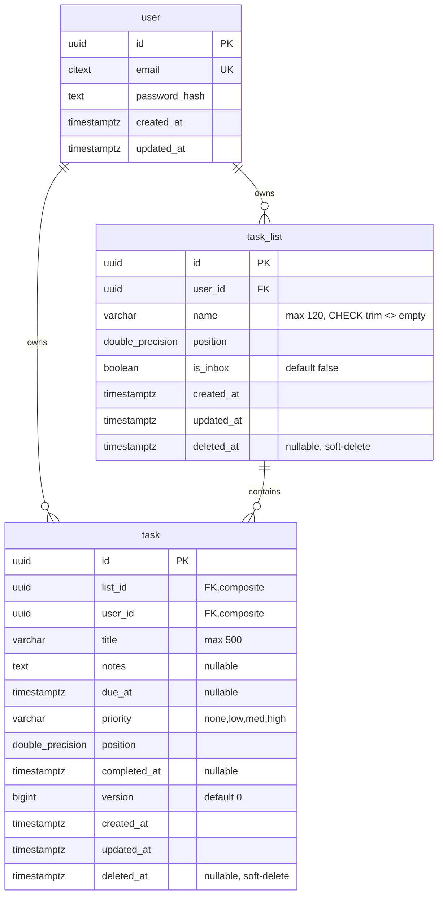

# Data Mapping

## Data Mapping — task_list Table (Already Exists)

### No New Table Required
The `task_list` table already exists in the Prisma schema and the init migration (`20260731045744_init`). All columns needed by this story are present.

### Existing Schema



### Migration Required — CHECK Constraint Only

The init migration is missing the `ck_task_list_name_not_blank` CHECK constraint referenced in the story's source reference. A new migration adds it:

```sql
ALTER TABLE "task_list"
  ADD CONSTRAINT "ck_task_list_name_not_blank"
  CHECK (trim(name) <> '');
```

This mirrors the existing `ck_task_title_not_blank` constraint on the `task` table.

### Column Usage for POST /v1/lists

| Column | Source | Notes |
|--------|--------|-------|
| `id` | `gen_random_uuid()` | DB-generated |
| `user_id` | JWT `sub` claim | Set by service, never from client |
| `name` | Request body | Trimmed by Zod, 1–120 chars |
| `position` | Server-calculated | `max(position) + 1024` for user's non-deleted lists |
| `is_inbox` | Hardcoded `false` | User-created lists are never inbox |
| `created_at` | DB default | `CURRENT_TIMESTAMP` |
| `updated_at` | DB default | `CURRENT_TIMESTAMP` |
| `deleted_at` | DB default | `NULL` |

### Existing Constraints & Indexes (No Changes)
- **PK**: `task_list_pkey` on `id`
- **Unique**: `task_list_id_user_id_key` on `(id, user_id)` — enables composite FK from tasks
- **FK**: `task_list_user_id_fkey` → `user(id)`
- No additional indexes needed for this story (creation-only, no listing/querying)
